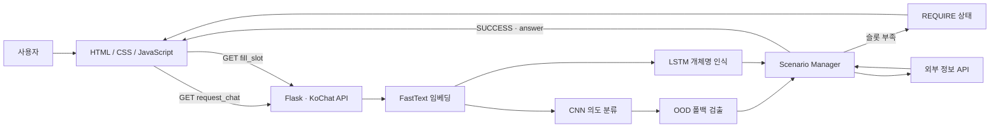

# 산학협력캡스톤 | 캠핑 추천 챗봇 서비스

전남대학교 소프트웨어공학과 3학년 전공 과목인 `산학협력캡스톤`에서 진행한 6인 팀 프로젝트입니다.
사용자의 지역과 취향을 바탕으로 캠핑장과 입문 장비를 추천하며, 서비스 내 챗봇 별칭은 `CAMPSTER`입니다.
오픈소스 한국어 챗봇 프레임워크 [KoChat](https://github.com/gusdnd852/kochat)을 활용했습니다.

> 담당 영역: 다른 팀원 1명과 챗봇 프론트엔드 공동 구현
>
> 주요 관심사: KoChat API와 채팅 UI의 연결, 대화 상태에 따른 화면 제어, 사용자 편의 UI

[팀 프로젝트 시연 영상 보기](./시연영상_데모.mp4)

## 프로젝트 개요

| 항목 | 내용 |
| --- | --- |
| 소속 | 전남대학교 소프트웨어공학과 |
| 교과목 | 3학년 전공 · 산학협력캡스톤 |
| 프로젝트명 | 캠핑 추천 챗봇 서비스 |
| 챗봇 별칭 | CAMPSTER |
| 기간 | 2022년 |
| 인원 | 6명 |
| 형태 | 전공 과목 팀 프로젝트 |
| 주요 기능 | 지역 기반 캠핑장 추천, 테마 기반 캠핑장 추천, 캠핑 장비 추천 |
| 기반 기술 | KoChat, Flask, Python, JavaScript |
| 당시 운영 | AWS 서버에서 KoChat 모델과 Flask API 실행 |
| 현재 상태 | API 키 없이 실행 가능한 로컬 데모와 고캠핑 API 연동 구조 제공 |

## 담당 역할

다른 팀원 1명과 함께 사용자가 직접 접하는 챗봇 프론트엔드를 담당했습니다.

- HTML·CSS 기반 모바일 챗봇 화면과 하단 내비게이션 구현
- 사용자 메시지와 챗봇 응답을 대화 순서에 맞게 동적으로 출력
- JavaScript로 입력, 버튼 선택, 대화 초기화, 자동 스크롤 처리
- KoChat API의 `state`와 `answer` 응답에 따라 다음 질문 또는 결과 화면을 분기
- 지역·테마·장비 선택 과정을 채팅 안에서 완료할 수 있도록 인터랙션 구성
- 팀원이 구현한 챗봇 모델·시나리오 API와 프론트엔드 연동

챗봇 모델 학습, 자연어 처리 모델, 서버 배포는 다른 팀원이 담당했습니다. 프론트엔드 구현 과정에서는 API 응답 구조와 시나리오 흐름을 함께 확인하며 연동 규격을 조율했습니다.

### 프론트엔드에서 중점적으로 다룬 부분

#### 1. KoChat API와 채팅 화면 연결

사용자 입력을 API에 전달하고 반환된 상태를 화면 동작으로 변환하는 흐름에 집중했습니다.

```text
사용자 입력
→ 메시지 전송 및 사용자 말풍선 생성
→ KoChat request_chat API 호출
→ intent / entity / state / answer 응답 확인
→ 추가 정보가 필요하면 fill_slot API 호출
→ 응답 말풍선 또는 추천 결과 렌더링
→ 최신 메시지 위치로 자동 스크롤
```

API 응답을 단순 텍스트로 출력하는 데 그치지 않고, 현재 대화 단계에 따라 선택 버튼과 후속 입력을 노출하도록 구성했습니다.

#### 2. 사용자 편의 중심 UI

- 직접 입력과 선택 버튼을 함께 제공해 입력 부담 완화
- 닉네임 입력 후에만 추천 기능을 노출해 대화 순서를 명확하게 구성
- 챗봇·사용자 메시지의 색상과 정렬을 구분
- 응답 대기 상태와 자동 스크롤을 적용해 대화 맥락 유지
- 홈·챗봇·커뮤니티에 공통 헤더와 하단 내비게이션 적용
- 모바일 화면과 데스크톱 미리보기에 대응하는 반응형 레이아웃 구현
- 긴 추천 카드가 입력 영역에 가려지지 않도록 독립 스크롤 영역 구성

## 주요 화면

최종 화면 캡처는 고캠핑 API 연결 검증 후 아래 경로에 추가할 예정입니다. 세 이미지는 동일한 모바일 해상도와 비율로 캡처합니다.

### 홈

서비스의 목적과 주요 기능을 소개하고 챗봇 시작 버튼을 제공합니다.

<!--
권장 파일: docs/images/screenshots/home.png
권장 규격: 390 × 844px 이상, PNG
<p align="center">
  
</p>
-->

> 화면 캡처 추가 예정: `docs/images/screenshots/home.png`

### 챗봇

닉네임 입력 후 지역·취향·장비 추천 중 하나를 선택합니다. 캠핑장 결과는 이미지, 주소, 설명, 태그가 포함된 카드로 표시합니다.

<!--
권장 파일: docs/images/screenshots/chat.png
권장 규격: 390 × 844px 이상, PNG
<p align="center">
  
</p>
-->

> 화면 캡처 추가 예정: `docs/images/screenshots/chat.png`

### 커뮤니티

캠핑 후기, 장비 거래, 캠핑장 추천 게시글을 카테고리별로 확인하는 프로토타입 화면입니다. 실제 게시글 저장 기능은 구현 범위에 포함하지 않았습니다.

<!--
권장 파일: docs/images/screenshots/community.png
권장 규격: 390 × 844px 이상, PNG
<p align="center">
  
</p>
-->

> 화면 캡처 추가 예정: `docs/images/screenshots/community.png`

## 화면 동작 흐름

| 화면 | 사용자 동작 | 결과 |
| --- | --- | --- |
| 홈 | `챗봇과 추천 시작하기` 선택 | 챗봇 화면으로 이동 |
| 챗봇 | 닉네임 입력 | 지역·취향·장비 추천 메뉴 표시 |
| 지역 추천 | 지역 관련 문장 또는 추천 버튼 선택 | 조건에 가까운 캠핑장 카드 표시 |
| 취향 추천 | 별, 바다, 노을 등 취향 입력 | 키워드와 일치하는 캠핑장 카드 표시 |
| 장비 추천 | 텐트·침낭·조명 등 장비 입력 | 입문 장비와 선택 기준 표시 |
| 커뮤니티 | 카테고리 선택 | 해당 카테고리의 예시 게시글만 표시 |
| 공통 | 하단 내비게이션 선택 | 홈·챗봇·커뮤니티 이동 |

## 전체 아키텍처

### KoChat을 선택한 이유

KoChat은 한국어 목적 지향형 대화를 위한 오픈소스 챗봇 프레임워크입니다. 데이터 전처리부터 임베딩, 의도 분류, 개체명 인식, 폴백 검출, 시나리오 실행, REST API 제공까지 하나의 파이프라인으로 구성할 수 있습니다.

CAMPSTER는 자유로운 잡담을 생성하는 챗봇보다 사용자가 원하는 캠핑 조건을 수집하고 추천 결과를 반환하는 것이 중요했습니다. 따라서 필요한 정보를 슬롯으로 정의하고 대화를 통해 채우는 KoChat의 `Slot Filling` 방식이 프로젝트 목적에 적합하다고 판단했습니다.

### 챗봇 기술 구성

| 단계 | 적용 기술 | 역할 |
| --- | --- | --- |
| 데이터 | Intent·Entity CSV, OOD 데이터 | 지원 의도와 개체 학습, 범위 밖 문장 검출 |
| 전처리·임베딩 | KoChat Dataset, FastText | 한국어 문장을 토큰화하고 벡터로 변환 |
| 의도 분류 | CNN, DistanceClassifier, CenterLoss | 사용자가 원하는 기능을 분류하고 가까운 의도 탐색 |
| 폴백 검출 | OOD 기반 FallbackDetector | 지원 범위 밖 질문을 잘못된 기능으로 연결하지 않도록 차단 |
| 개체명 인식 | LSTM, CRFLoss | 문장에서 지역·날짜·장비 카테고리 등의 슬롯 추출 |
| 대화 관리 | Scenario, ScenarioManager | 의도별 필수 슬롯 확인, 추가 질문 또는 API 호출 결정 |
| API 제공 | Flask, KochatApi | 분석 결과와 대화 상태를 JSON으로 제공 |
| 화면 연동 | JavaScript, Ajax | API 상태에 따라 메시지·추가 질문·추천 결과 출력 |

`demo/application.py`의 실행 구성은 다음 조합을 사용합니다.

```python
Dataset(ood=True)
→ GensimEmbedder(FastText)
→ DistanceClassifier(CNN + CenterLoss)
→ EntityRecognizer(LSTM + CRFLoss)
→ ScenarioManager
→ Flask REST API
```

학습 단계에서는 Intent·Entity·OOD 데이터를 이용해 각 프로세서를 학습하고 모델 파일을 저장합니다. 서비스 실행 단계에서는 저장된 모델을 불러와 추론하고, 분석 결과를 시나리오와 연결합니다.

- CNN은 문장의 특징 벡터를 추출하고 `DistanceClassifier`는 의도별 특징 공간을 기준으로 가까운 클래스를 찾습니다.
- `CenterLoss`는 같은 의도의 특징 벡터가 중심에 모이도록 학습해 의도 분류와 폴백 판별을 돕습니다.
- LSTM과 CRF는 토큰 순서와 태그 사이의 관계를 함께 고려해 개체명을 인식합니다.

### 질문 처리 과정

1. 프론트엔드가 사용자 ID와 입력 문장을 `request_chat` API로 전달합니다.
2. KoChat이 문장을 전처리하고 FastText 임베딩 벡터로 변환합니다.
3. CNN 기반 `DistanceClassifier`가 의도를 분류합니다.
4. OOD 폴백 검출기가 지원 범위를 벗어난 문장인지 확인합니다.
5. LSTM·CRF 기반 `EntityRecognizer`가 지역이나 장비 카테고리 같은 개체를 추출합니다.
6. `ScenarioManager`가 해당 의도에 필요한 슬롯이 모두 채워졌는지 검사합니다.
7. 슬롯이 부족하면 `REQUIRE_{ENTITY}` 상태를 반환하고 프론트엔드가 추가 질문을 표시합니다.
8. 사용자의 후속 입력은 `fill_slot` API로 전달되어 이전 대화 정보와 합쳐집니다.
9. 슬롯이 모두 채워지면 시나리오가 외부 정보 API를 호출하고 `SUCCESS` 상태와 답변을 반환합니다.
10. 지원하지 않는 질문은 `FALLBACK` 상태로 처리해 안내 메시지를 표시합니다.

### 챗봇 동작 흐름도



- KoChat이 사용자 문장의 의도와 개체를 분석합니다.
- `ScenarioManager`가 의도에 맞는 날씨·관광·장비 시나리오를 실행합니다.
- 필요한 개체가 부족하면 추가 질문을 반환하고, 프론트엔드는 다음 입력을 받습니다.
- 시나리오가 완료되면 외부 API 결과를 채팅 응답으로 표시합니다.
- 당시 장비 검색에는 Naver 쇼핑 검색 API를 사용했습니다.

## API 설계

### KoChat API

| Method | Endpoint | 역할 |
| --- | --- | --- |
| GET | `/request_chat/{uid}/{text}` | 의도·개체 분석 후 시나리오 상태와 답변 반환 |
| GET | `/fill_slot/{uid}/{text}` | 이전 대화에서 부족했던 개체 정보를 추가 |
| GET | `/get_intent/{text}` | 의도 분류 결과 확인 |
| GET | `/get_entity/{text}` | 개체명 인식 결과 확인 |

주요 응답 필드는 다음과 같습니다.

| 필드 | 설명 |
| --- | --- |
| `input` | 전처리된 사용자 입력 |
| `intent` | 분류된 사용자 의도 |
| `entity` | 문장에서 추출한 개체 |
| `state` | 추가 입력 요청, 응답 완료, 폴백 등의 대화 상태 |
| `answer` | 시나리오가 생성한 최종 답변 |

### 고캠핑 API 프록시

| Method | Endpoint | 역할 |
| --- | --- | --- |
| GET | `/api/campsites?q={query}` | 고캠핑 목록을 질문 키워드로 정렬해 최대 3개 반환 |

- API 키는 Python 서버의 환경변수에서만 읽으며 브라우저에 전달하지 않습니다.
- 전체 캠핑장 목록은 30분 동안 메모리에 캐시합니다.
- 키 미설정, 네트워크 오류, 잘못된 응답은 안전한 폴백 코드로 변환합니다.
- 실 API를 사용할 수 없으면 동일한 UI 구조의 예시 데이터로 자동 전환합니다.

## 기술 스택

| 구분 | 기술 |
| --- | --- |
| 담당 프론트엔드 | HTML5, CSS3, JavaScript, jQuery, Bootstrap |
| 현재 UI 개선 | Vanilla JavaScript, Web Components, 반응형 CSS |
| 챗봇 API | Python, Flask, KoChat |
| 자연어 처리 | FastText, CNN Intent Classifier, LSTM Entity Recognizer |
| 외부 데이터 | Naver 쇼핑 검색 API(2022), 한국관광공사 고캠핑 API(현재) |
| 인프라 | AWS(2022 시연), Python 로컬 서버(현재 데모) |

## 로컬 실행

현재 데모는 Python 표준 라이브러리만으로 실행할 수 있습니다.

```bash
git clone https://github.com/minjuko/2022capstone.git
cd 2022capstone
python demo_server.py
```

```powershell
py demo_server.py
```

브라우저에서 [http://127.0.0.1:8000](http://127.0.0.1:8000)을 엽니다.

API 키가 없으면 예시 데이터 모드로 실행되므로 지역·취향·장비 추천의 전체 UI 흐름을 바로 확인할 수 있습니다.

## 프로젝트 구조

```text
.
├── demo/
│   ├── application.py          # 2022 KoChat · Flask 애플리케이션
│   ├── scenario.py             # 의도별 챗봇 시나리오
│   ├── equipment.py            # 현재 로컬 장비 추천 가이드
│   ├── data/                   # 의도·개체 학습 데이터
│   ├── templates/              # 홈·챗봇·커뮤니티 화면
│   └── static/
│       ├── css/                # 공통·반응형 UI
│       ├── js/main.js          # 대화 상태와 추천 결과 렌더링
│       └── js/components.js    # 공통 헤더·하단 내비게이션
├── kochat/                     # KoChat 기반 챗봇 프레임워크
├── docs/legacy/                # 2022 외부 API 구현 기록
├── tests/                      # 로컬 API·장비 추천 테스트
├── demo_server.py              # 현재 로컬 데모 및 고캠핑 프록시
└── 시연영상_데모.mp4           # 2022 AWS 기반 시연 영상
```

## 2022 구현과 현재 리팩토링 사항

| 구분 | 2022 팀 프로젝트 | 현재 리팩토링                       |
| --- | --- |-------------------------------|
| 챗봇 실행 | AWS의 KoChat·Flask 서버 | API 키 없이 실행 가능한 로컬 데모         |
| 캠핑장 데이터 | 당시 서버 시나리오와 외부 API | 고캠핑 API와 예시 데이터 폴백            |
| 장비 검색 | Naver 쇼핑 검색 API | 서비스 독립적인 입문 장비 가이드            |
| 프론트엔드 | jQuery·인라인 이벤트 중심 | Vanilla JS 이벤트와 상태 기반 렌더링     |
| 공통 UI | 화면별 중복 구조 | Web Components 기반 공통 헤더·내비게이션 |
| 반응형 | 모바일 시연 화면 중심 | 모바일·데스크톱 공통 프레임               |
| 보안 | 과거 코드에 인증정보 포함 | 환경변수 전환 및 Git 이력에서 인증정보 제거    |

Naver 쇼핑 API가 2026년 7월 31일부로 지원 종료될 예정이므로, 포트폴리오의 지속성을 위해 외부 데이터 연동을 고캠핑 API 기반으로 전환했습니다. 기존 Naver 쇼핑 API 구현은 인증정보를 제거한 뒤 [`docs/legacy/naver_shopping_api.py`](./docs/legacy/naver_shopping_api.py)에 기록용으로 보존했으며, 장비 추천은 외부 서비스에 의존하지 않는 입문 장비 가이드로 대체했습니다.

## 테스트

```bash
python -m unittest discover -s tests -v
```

현재 자동 테스트 범위:

- 고캠핑 응답의 단일·복수 항목 정규화
- 지역 키워드 기반 캠핑장 정렬
- API 키 미설정 처리
- 외부 API 오류에서 인증정보가 노출되지 않는지 확인
- 장비 카테고리별 가이드와 기본 응답

## 참고 및 라이선스

- 기반 프레임워크: [KoChat](https://github.com/gusdnd852/kochat), Copyright 2020 Hyunwoong Ko
- KoChat 및 저장소에 포함된 기반 코드는 [Apache License 2.0](./LICENSE)에 따라 사용했습니다.
- CAMPSTER 팀은 KoChat 기반 코드에 캠핑 도메인 데이터, 시나리오, 외부 API 연동, 화면과 사용자 흐름을 추가했습니다.
- 원 저작권·라이선스 고지는 소스 파일과 `LICENSE`에 유지했습니다.
- 저장소 내 KoChat 문서: [프레임워크 소개](./docs/01_kochat_이란.md), [챗봇 동작 원리](./docs/02_about_chatbot.md), [API·모델 사용법](./docs/04_usage.md), [데모 애플리케이션](./docs/07_demo.md)
- UI 폰트: [Freesentation](https://freesentation.blog/freesentation), [SIL OFL 1.1](./demo/static/fonts/LICENSE.md)
- 하단 내비게이션 아이콘: [Lucide](https://lucide.dev/), [ISC License](./demo/static/icons/LICENSE.txt)
