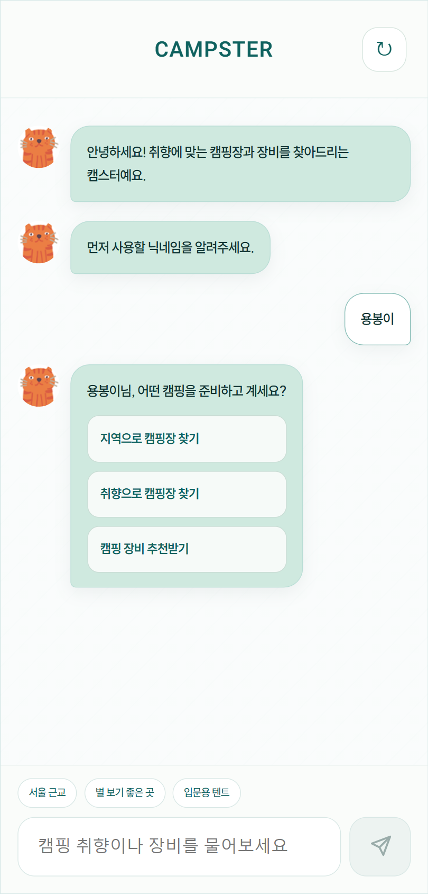
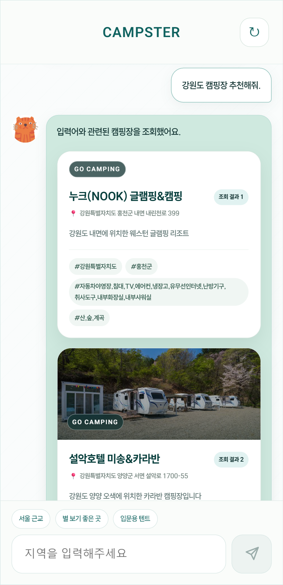
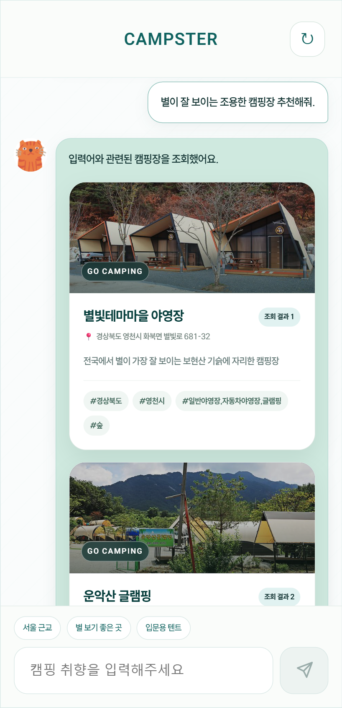
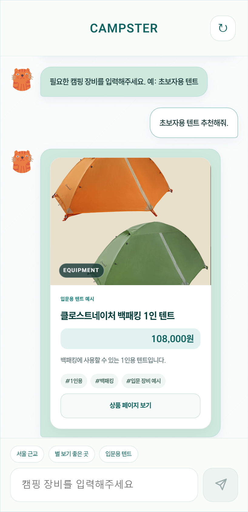
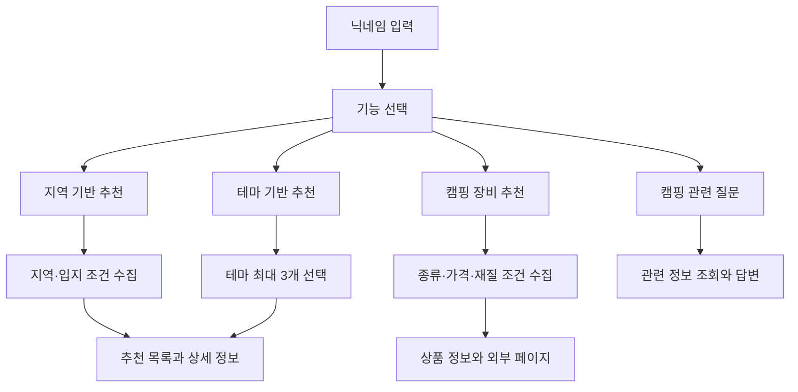
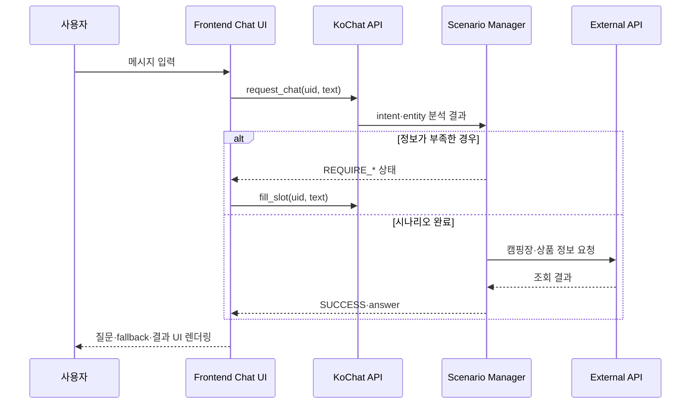

# 캠핑 추천 챗봇 서비스 CAMPSTER

> 당신의 캠핑 취향을 찾아주는 친구, 캠스터

`CAMPSTER`는 캠핑장과 캠핑 장비 탐색을 돕는 모바일 챗봇 서비스입니다.
2022년 전남대학교 소프트웨어공학과 산학협력 캡스톤에서 6인 팀 `아이러닝`이 진행했습니다.

[2022년 실제 시연 영상 보기](./시연영상_데모.mp4)

## 프로젝트 개요

| 항목 | 내용 |
| --- | --- |
| 프로젝트 | CAMPSTER · 캠핑 추천 챗봇 |
| 기간 | 2022년 |
| 형태 | 전남대학교 소프트웨어공학과 산학협력 캡스톤 |
| 인원 | 6명 |
| 목표 | 대화를 통해 조건을 수집하고 캠핑장과 캠핑 장비 탐색 지원 |
| 주요 기술 | KoChat, Flask, Python, PyTorch, HTML, CSS, JavaScript |
| 인프라 | 대학 개발환경 지원사업을 통한 NHN Cloud 서버·GPU |

기업과 학교에서 제시한 산학협력 프로젝트 계획을 바탕으로 팀에서 서비스 주제를 구체화했습니다. 초기 여행 추천 챗봇 아이디어를 캠핑 도메인에 집중해 발전시키고, 지역·취향·장비라는 세 가지 탐색 흐름을 하나의 모바일 채팅 화면에 구성했습니다.

## 서비스 화면

아래 화면은 서버 종료 이후 정리한 로컬 실행 화면입니다. 가독성과 반응형 UI는 보완했지만 CAMPSTER의 캐릭터, 색상, 모바일 채팅 구조와 지역·취향·장비의 주요 대화 흐름은 2022년 시연 구성을 따릅니다.

<table>
  <tr><th>대화 시작</th><th>지역 기반 추천</th><th>취향 기반 추천</th><th>장비 추천</th></tr>
  <tr><td></td><td></td><td></td><td></td></tr>
</table>

## 주요 기능

### 지역 기반 캠핑장 추천

사용자가 원하는 지역을 입력하면 입지 조건을 추가로 질문하고, 조건에 맞는 캠핑장 목록과 상세 정보를 제공합니다. 캠핑장 이름, 이미지, 주소, 소개, 부대시설, 장비 대여 및 반려동물 출입 여부 등을 표시했습니다.

### 테마 기반 캠핑장 추천

노을, 바다, 반려동물, 별, 물놀이, 단풍 등 캠핑 취향을 해시태그로 제시했습니다. 사용자는 최대 3개를 선택할 수 있으며, 선택한 테마를 바탕으로 캠핑장 결과를 확인할 수 있습니다.

### 캠핑 장비 추천

텐트, 침낭·매트, 조명, 화로·BBQ 등 장비 분류를 선택하고 가격대나 재질 같은 조건을 입력하면 Naver 쇼핑 검색 API를 통해 관련 상품 정보를 제공했습니다.

### 캠핑 관련 질문 응답

NHN Cloud GPU 서버에서 실행한 KoChat이 사용자의 캠핑 관련 질문에서 의도와 정보를 인식하고, 시나리오에 연결된 데이터와 외부 API에서 필요한 정보를 조회해 채팅으로 답변했습니다. 질문에 필요한 조건이 부족하면 후속 질문을 통해 대화를 이어가도록 구성했습니다.

## 사용자 흐름

## KoChat 연동 구조

[KoChat](https://github.com/gusdnd852/kochat)은 프로젝트에 활용한 오픈소스 한국어 챗봇 프레임워크입니다. KoChat 자체를 개발한 것이 아니라 캠핑 시나리오와 데이터, 외부 API, 사용자 화면을 연결해 서비스를 구성했습니다.

Frontend는 API가 반환한 `state`와 `answer`를 확인했습니다. `SUCCESS`이면 답변 또는 결과 카드를 표시하고, `REQUIRE_*`이면 다음 입력을 `fill_slot`으로 전달해 이전 대화의 정보와 결합했습니다.

## 데이터와 외부 API

- **캠핑장 정보:** 한국관광공사 고캠핑 데이터 서비스를 활용해 캠핑장 정보를 수집·가공했습니다.
- **캠핑 장비:** Naver 쇼핑 검색 API를 사용해 선택 조건과 관련된 상품 정보를 조회했습니다.
- **챗봇 시나리오:** 지역·테마·장비 흐름에 필요한 intent와 entity, 추가 질문을 구성했습니다.
- **결과 표현:** 외부 API 응답을 채팅 말풍선과 결과 카드에 표시할 수 있는 형태로 연결했습니다.

## 기술 스택

| 영역 | 기술 |
| --- | --- |
| Frontend | HTML5, CSS3, JavaScript, jQuery, Bootstrap |
| Chatbot / Backend | KoChat, Flask, Python |
| NLP 구성 | FastText, CNN Intent Classifier, LSTM·CRF Entity Recognizer |
| Data / API | 한국관광공사 고캠핑, Naver 쇼핑 검색 API, MongoDB |
| Infrastructure | NHN Cloud, GPU |
| Collaboration | GitHub, Slack, Zoom, Google Docs·Sheets, Notion |

KoChat 내부의 FastText·CNN·LSTM·CRF 구성은 활용한 오픈소스 프레임워크의 기술 범위이며, 팀이 NLP 프레임워크 전체를 처음부터 자체 개발했다는 의미가 아닙니다.

## 담당 역할

챗봇 Frontend는 팀원 2명이 공동으로 담당했습니다. 개인 담당 범위는 다음과 같습니다.

- 모바일 중심 채팅 화면과 사용자·챗봇 메시지 렌더링
- 입력창, 선택 버튼, 자동 스크롤 등 채팅 interaction 구현
- KoChat API 호출과 `state`·`answer` 응답의 화면 연결
- 상태에 따른 추가 질문, fallback 및 추천 결과 UI 분기
- 지역·테마·장비 시나리오가 채팅 안에서 이어지도록 대화 흐름 구성

KoChat 프레임워크 자체, NLP 모델 학습 로직, 전체 Backend, 데이터셋 구축과 NHN Cloud 서버 구성은 개인 단독 구현 범위가 아닙니다. 역할이 나뉜 팀원들과 API 응답 구조와 시나리오 흐름을 조율했습니다.

## 협업과 멘토링

산학협력 프로젝트 과정에서 약 2주 간격으로 현직 개발자와 진행 상황을 공유하고 구현 방향과 문제 해결에 대한 피드백을 받았습니다. 미팅은 주로 비대면으로 진행했고 한 차례 대면 미팅도 가졌습니다.

이는 기업 개발팀과 공동 개발하거나 상용 프로젝트의 코드 리뷰를 받은 것이 아니라, 팀이 직접 개발하면서 정기적으로 진행 방향을 점검받은 멘토링 경험입니다.

## 프로젝트를 통해 배운 점

- 모델의 결과를 실제 사용자 대화와 화면 흐름으로 연결하는 Frontend 역할을 경험했습니다.
- 일반적인 페이지 UI와 달리 이전 대화 상태가 다음 질문과 화면을 결정하는 구조를 이해했습니다.
- 오픈소스 프레임워크를 처음부터 다시 만드는 대신 요구사항에 맞게 분석하고 활용했습니다.
- Frontend·챗봇·Backend 역할이 나뉜 팀에서 API 규격과 상태 정의를 맞추는 과정을 경험했습니다.

## 프로젝트 자료

- [2022년 실제 시연 영상](./시연영상_데모.mp4)
- [KoChat 프레임워크 소개](./docs/01_kochat_이란.md)
- [KoChat API·모델 사용법](./docs/04_usage.md)

## 서버 종료 이후 보존 작업

수업 종료 후 NHN Cloud 서버와 기존 실행 환경을 더 이상 유지하지 않아 원본 시스템을 그대로 실행하기 어려워졌습니다. 저장소의 기능과 UI를 확인할 수 있도록 `portfolio` 브랜치에서 다음 보존 작업을 진행했습니다.

- 실제 KoChat 추론 없이 주요 채팅 흐름을 확인할 수 있는 localhost 전용 데모 구성
- 지원이 종료된 Naver 쇼핑 검색 대신 장비 예시 데이터로 화면 흐름 보존
- GoCamping API를 현재 로컬 서버에서 직접 조회하고, API 미설정·오류 시 예시 데이터 제공
- CAMPSTER 이름, 캠미 캐릭터, green/teal 색상과 모바일 채팅 구조 유지
- 반응형 레이아웃, 입력 가독성, 스크롤, 결과 카드와 기본 접근성 보완
- 과거 인증정보를 제거하고 API 키를 환경변수로 관리

이 정리는 2022년 챗봇 모델이나 서버를 복원한 것이 아니라, 종료된 의존성을 대체해 프로젝트의 화면과 핵심 사용자 흐름을 검토할 수 있도록 한 보존용 리팩토링입니다. 현재 캠핑장 조회는 단순 문자열 일치이며 원본 KoChat 추천 및 Slot Filling과 동일하지 않습니다.

## Credits

- 2022 전남대학교 소프트웨어공학과 산학협력 캡스톤, 6인 팀 `아이러닝`
- KoChat Copyright 2020 Hyunwoong Ko
- KoChat 및 저장소의 기반 코드는 [Apache License 2.0](./LICENSE)에 따라 사용했습니다.
- CAMPSTER의 캠핑 도메인 데이터·시나리오·외부 API·화면은 팀 협업 결과물입니다.
