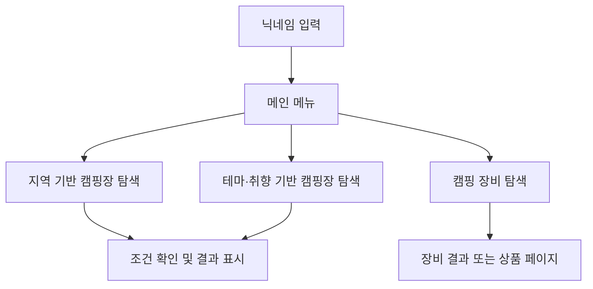
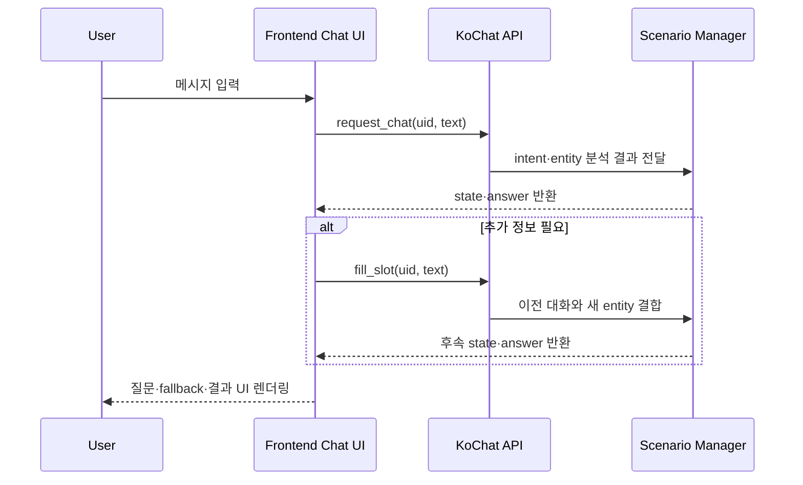

# CAMPSTER

> 2022 Capstone Project · Camping Chatbot · KoChat Integration · Frontend Collaboration

KoChat 오픈소스 프레임워크를 활용해 캠핑장과 캠핑 장비 탐색을 돕는 모바일 챗봇을 구현한 전남대학교 소프트웨어공학과 산학협력 캡스톤 프로젝트입니다.

  

> 위 화면은 원본 프로젝트의 정체성과 주요 대화 흐름을 보존해 정리한 현재 포트폴리오 데모입니다.
> 2022년 당시의 KoChat 추론 환경과 현재 로컬 데모의 재현 범위는 아래에서 구분합니다.

## Project Overview

2022년 전남대학교 소프트웨어공학과 산학협력 캡스톤에서 6명이 함께 진행했습니다. KoChat·Flask와 HTML·CSS·JavaScript를 바탕으로 지역·취향에 따른 캠핑장과 캠핑 장비 탐색을 지원했습니다.

기업과 학교에서 제시한 산학협력 프로젝트 계획을 출발점으로 삼아, 팀에서 여행 추천 챗봇 아이디어를 캠핑 도메인에 맞춘 `CAMPSTER`로 구체화했습니다. 완성도 높은 최신 AI 서비스보다는 당시의 협업 과정과 Frontend–챗봇 API 연동 경험을 보존하는 프로젝트 아카이브입니다.

## My Role

다른 팀원 1명과 챗봇 Frontend를 공동 구현했습니다.

- 모바일 중심 채팅 화면과 사용자·챗봇 메시지 렌더링
- 입력창, 선택 버튼, 자동 스크롤 등 채팅 interaction 구현
- KoChat API 호출과 `state`·`answer` 응답의 화면 연결
- 응답 상태에 따른 추가 질문, 추천 결과, fallback UI 분기
- 지역·테마·장비 시나리오가 채팅 안에서 이어지도록 Frontend 흐름 구성

KoChat 프레임워크 자체, NLP 모델 구조와 학습 로직, 전체 Backend와 NHN Cloud 서버 구축은 개인 단독 구현 범위가 아닙니다. 모델·시나리오·서버를 담당한 팀원과 응답 형식 및 대화 흐름을 맞추며 Frontend 연동을 담당했습니다.

## Core User Flow

2022년 원본에서는 지역과 입지에 대한 추가 질문, 최대 3개의 테마 선택, 장비 종류·가격·재질 질문처럼 필요한 조건을 단계적으로 수집했습니다. 인식할 수 없는 입력에는 재질문 안내를 반환했습니다.

## KoChat Integration

KoChat은 팀이 처음부터 만든 NLP 프레임워크가 아니라 프로젝트에 활용한 오픈소스 한국어 챗봇 프레임워크입니다. 제 작업의 중심은 모델 내부 구현보다 그 결과를 사용자가 이해할 수 있는 대화 UI로 연결하는 일이었습니다.

원본 JavaScript는 `SUCCESS`, `REQUIRE_*` 등의 상태를 확인해 답변을 표시하거나 `fill_slot` 요청으로 다음 입력을 전달했습니다. 추천 결과는 캠핑장 이름, 이미지, 주소, 소개와 상세 정보 형태로 채팅에 렌더링했습니다.

## Key Features in 2022

지역·입지 조건과 최대 3개의 테마를 수집하는 캠핑장 탐색, Naver 쇼핑 검색 API를 활용한 장비 탐색, Slot Filling 추가 질문과 fallback을 구현했습니다. 캠핑장 정보에는 한국관광공사 고캠핑 데이터를 활용했습니다. 대학교 개발환경 지원사업을 통해 NHN Cloud에 서버를 구축하고 GPU를 활용해 KoChat 기반 챗봇을 구현·시연했습니다.
[2022 시연 영상](./시연영상_데모.mp4)에서 당시 실제 동작을 확인할 수 있습니다.

## 2022 Original vs Current Portfolio Demo

| 구분 | 2022 원본 팀 프로젝트 | 현재 포트폴리오 데모 |
| --- | --- | --- |
| 목적 | KoChat 기반 캠핑 챗봇 구현·시연 | 종료된 실행 환경 없이 UI와 흐름 확인 |
| 챗봇 처리 | 실제 KoChat 모델/API와 Slot Filling | 실제 KoChat 추론 없음 |
| 캠핑장 데이터 | 고캠핑 데이터를 서버 측에서 가공·활용 | GoCamping API를 로컬 프록시에서 직접 조회 |
| 결과 선택 | 시나리오와 대화 상태에 따른 추천 흐름 | 입력 토큰의 단순 문자열 일치 결과 |
| 장비 | Naver 쇼핑 검색 API | 고정된 예시 장비 데이터 |
| 실행 환경 | 대학 개발환경 지원사업의 NHN Cloud 서버·GPU | `127.0.0.1` 전용 로컬 Python 서버 |
| UI | 2022 모바일 채팅 화면 | 정체성을 유지한 가독성·반응형·접근성 보완 |

두 구현은 같은 CAMPSTER 프로젝트의 원본과 보존용 데모이며, 서로 다른 두 서비스 버전으로 포장하지 않습니다.

## Screens

아래 이미지는 모두 현재 포트폴리오 데모 화면입니다.

### Campground Search

<table>
  <tr>
    <th>지역 입력</th>
    <th>취향 입력</th>
  </tr>
  <tr>
    <td></td>
    <td></td>
  </tr>
</table>

캠핑장 카드는 현재 GoCamping API 조회 결과이며, API 키가 없거나 호출에 실패하면 예시 데이터임을
대화 첫 문장에서 알립니다. 이 조회 방식은 2022 KoChat 추천 모델과 동일하지 않습니다.

### Equipment Demo

  

현재 포트폴리오 데모에서는 종료된 기존 상품 검색 환경 대신 예시 장비 데이터를 표시합니다.
위 카드는 실시간 Naver 쇼핑 API 검색 결과가 아닙니다.

## Tech Stack

| 영역 | 2022 프로젝트 | 현재 데모 |
| --- | --- | --- |
| Frontend | HTML5, CSS3, JavaScript, jQuery, Bootstrap | Vanilla JavaScript, Web Components, responsive CSS |
| Chatbot / Backend | KoChat, Flask, Python, PyTorch | Python 표준 라이브러리 기반 로컬 서버 |
| KoChat 구성 | FastText, CNN intent classifier, LSTM·CRF entity recognizer | 실행하지 않음 |
| External Data | 한국관광공사 고캠핑, Naver 쇼핑 검색 API | GoCamping API, 로컬 fallback·장비 예시 |
| Infrastructure | NHN Cloud 서버·GPU(대학 개발환경 지원사업) | Localhost only |
| Collaboration | Slack, Zoom, Google Docs·Sheets, Notion, GitHub | Git history와 문서·영상 기반 보존 |

KoChat 내부 모델 구성은 사용한 프레임워크와 팀 전체 기술 범위를 설명하기 위한 항목이며 개인이 해당 모델을
처음부터 설계했다는 의미가 아닙니다.

## Collaboration & Mentoring

학교 전공 수업의 산학협력 프로젝트로 진행했으며, 약 2주 간격으로 현직 개발자에게 진행 상황과 구현 방향을
공유하고 피드백을 받았습니다. 미팅은 주로 비대면으로 진행했고 한 차례 대면 미팅도 가졌습니다. 이는 기업
개발팀과 공동 개발하거나 상용 코드 리뷰를 받은 경험이 아니라, 팀 개발 과정을 점검받은 멘토링 경험입니다.

## What I Learned

- **Frontend와 AI 서비스 연결:** 모델 구현과 모델의 결과를 사용자 경험으로 연결하는 책임이 다름을 배웠습니다.
- **Conversation State:** 이전 대화와 응답 상태에 따라 다음 질문과 UI가 달라지는 인터페이스를 경험했습니다.
- **Open Source Integration:** 기존 프레임워크의 API와 동작 방식을 이해하고 프로젝트 흐름에 맞게 활용했습니다.
- **Team Interface:** 역할이 나뉜 팀에서 응답 규격과 상태 이름을 합의하는 일이 기능 연결에 중요함을 배웠습니다.

## Portfolio Cleanup

- 원본 CAMPSTER 이름, 캠미 캐릭터, green/teal 색상과 모바일 채팅 구조 유지
- 종료된 KoChat·NHN Cloud 환경 없이 실행 가능한 로컬 데모 구성
- 반응형 레이아웃, 입력 가독성, focus·disabled·`aria-live` 등 기본 접근성 보완
- GoCamping API 오류·미설정 fallback과 결과 출처 안내 추가
- 이미지 없는 결과 카드, 긴 콘텐츠, 스크롤 및 결과 시작 위치 보완
- 과거 인증정보를 제거하고 환경변수 기반 API 키 사용

## Limitations

- 현재 데모는 실제 KoChat inference와 원본 Slot Filling 전체를 재현하지 않습니다.
- 현재 캠핑장 검색은 단순 문자열 일치이며 2022 추천 흐름과 동일하지 않습니다.
- 캠핑장 실데이터는 외부 GoCamping API의 가용성과 API 키 설정에 의존합니다.
- 장비 카드는 화면 흐름 보존을 위한 예시이며 실시간 상품 검색이 아닙니다.
- 원본 NHN Cloud 서버·GPU 실행 환경과 하단 Home·Community 프로토타입은 현재 데모 범위에 포함하지 않습니다.
- 현재 UI는 원본 정체성을 유지하되 포트폴리오 열람을 위해 일부 가독성과 사용성을 개선했습니다.

## Team & Credits

- 2022 전남대학교 소프트웨어공학과 산학협력 캡스톤, 6인 팀 `아이러닝`
- 기반 프레임워크: [KoChat](https://github.com/gusdnd852/kochat), Copyright 2020 Hyunwoong Ko
- KoChat 및 저장소의 기반 코드는 [Apache License 2.0](./LICENSE)에 따라 사용했습니다.
- CAMPSTER의 캠핑 도메인 데이터·시나리오·외부 API·화면은 팀 협업 결과물입니다.
- 프로젝트 원본 자료는 `docs/`, 실제 시연 기록은 `시연영상_데모.mp4`에 보존했습니다.
